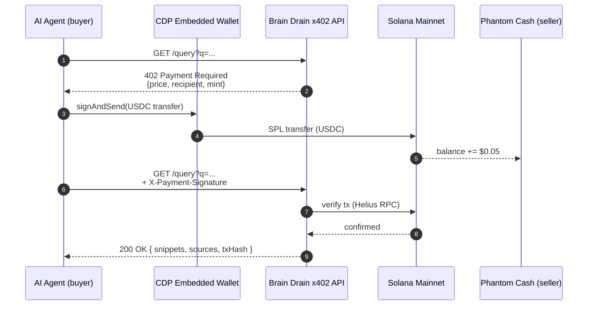

<div align="center">

# Brain Drain

**Sell your knowledge to the machines.**

An `x402`-gated personal knowledge marketplace where autonomous AI agents pay individual experts in USDC — settled on Solana in ~400ms, delivered straight into Phantom Cash.

[](./LICENSE)
[](https://solana.com)
[](https://colosseum.com/frontier)
[](https://github.com/Bekirerdem/brain-drain)

[Live demo](#) · [Architecture](./docs/architecture.md) · [11-day Roadmap](./docs/roadmap.md) · [Frontier submission](https://arena.colosseum.org/u/Beks)

</div>

---

## The problem

Open-web training data is exhausted. The most valuable knowledge — the kind that actually moves a domain forward — lives in private vaults: researchers' notebooks, engineers' war-stories, lawyers' precedent files, traders' edge cases. Today, AI agents either hallucinate around this gap or scrape it without consent. The humans who curated that knowledge get nothing back.

There has never been a frictionless rail for an AI agent to compensate the human whose context it just consumed.

## The inversion

Brain Drain flips the data economics of agentic AI. An expert points the app at any Markdown directory — Obsidian, Notion export, internal wiki — and Brain Drain turns it into an `x402`-protected micro-API:

1. An external agent calls `/query` with a natural-language question.
2. The endpoint replies `402 Payment Required` with a USDC price quote (default `$0.05`).
3. The agent's wallet — a Coinbase CDP Embedded Wallet on Solana — auto-funds, auto-signs, and re-issues the request with a payment proof.
4. Helius RPC verifies the SPL transfer in sub-second time. The endpoint returns the top-k snippets from the vault.
5. The seller's USDC lands in their **Phantom Cash** balance instantly.

No subscriptions. No API keys. No middlemen. Pure machine-to-human commerce.

## How it works



See [`docs/architecture.md`](./docs/architecture.md) for component-level detail (RAG layer, x402 middleware, MCP server, dashboard).

## Tech stack

| Layer | Choice | Why |
| :-- | :-- | :-- |
| Framework | **Next.js 16** (App Router) on Vercel | Fast iteration, edge-compatible, first-class TS |
| Settlement | **Solana mainnet** via `@solana/web3.js` + `@solana/spl-token` | Sub-second finality, fees too small to matter |
| Payment standard | **`x402`** (Coinbase / Cloudflare protocol) | The native rail for machine-to-machine commerce |
| Buyer wallet | **Coinbase CDP** Embedded Wallets (`@coinbase/cdp-sdk`) | TS-only MPC, no Anchor program needed |
| Seller payout | **Phantom Cash** | USDC arrives directly in the seller's daily-driver wallet |
| RPC | **Helius** | ~400 ms confirmations, free tier covers the demo |
| Reasoning | **Gemini 3.1 Pro Preview** with `thinking_level` | Frontier-class extraction over private snippets |
| Embeddings | **`gemini-embedding-001`** | Free tier handles the entire vault index |
| Agent surface | **MCP server** | Drops straight into Claude Desktop, Cursor, Codex |
| Optional | Claude Haiku 4.5 multi-model demo | Showcases agents paying multiple LLM providers |

> **No Anchor / Rust required.** All on-chain logic is composed from existing primitives (SPL transfers, CDP MPC, x402). The novelty is in the wiring, not in a custom program.

## Frontier 2026 — sponsor bounties targeted

| Bounty | How Brain Drain hits it |
| :-- | :-- |
| Best Multi-Protocol Agent | x402 + AgentPay + CDP wallet flow chained end-to-end |
| Best Use of Phantom CASH | Seller payouts surface natively in the Cash tab |
| Best Usage of CDP Embedded Wallets | Buyer-side MPC wallets created and funded autonomously |
| Best AgentPay Demo | The 3-minute submission video is, by definition, an AgentPay demo |
| Best x402 Integration | Reference implementation of x402 on Solana for knowledge-as-a-service |

## Quickstart

> **Prerequisites:** [Bun](https://bun.sh) ≥ 1.3, a Helius API key, a Coinbase CDP project (with Wallet Secret), a Google AI key with access to Gemini 3.1 Pro Preview, and a Solana wallet to receive payouts.

```bash
git clone https://github.com/Bekirerdem/brain-drain.git
cd brain-drain
bun install

# Fill in keys — see comments in .env.example for sources
cp .env.example .env.local

# Seed the vault (Day 1+)
bun run scripts/seed-vault.ts ./path/to/your/markdown

# Run the API + dashboard
bun dev
```

The endpoint will be live at `http://localhost:3000/api/query`. To run a paying-agent demo, follow [`docs/roadmap.md`](./docs/roadmap.md).

## Roadmap

11-day solo sprint, public commits from Day 0. Full plan in [`docs/roadmap.md`](./docs/roadmap.md).

- [x] **Day 0 (1 May)** — Repo, scaffold, accounts, env, grant application
- [ ] **Day 1–2 (2–3 May)** — Markdown loader + Gemini RAG index + x402 middleware on devnet
- [ ] **Day 3–4 (4–5 May)** — CDP Embedded Wallet buyer flow, auto-fund + auto-sign
- [ ] **Day 5 (6 May)** — Phantom Cash payout integration
- [ ] **Day 6 (7 May)** — MCP server for Claude Desktop / Cursor
- [ ] **Day 7 (8 May)** — Seller dashboard, mainnet cutover
- [ ] **Day 8 (9 May)** — Demo video, README polish, mainnet smoke tests
- [ ] **Day 9 (10 May)** — Submit to Colosseum Frontier 2026
- [ ] **Day 10 (11 May)** — Buffer + post-submission outreach

## Contributing

This is an active hackathon build, but issues, ideas, and friendly heckling are welcome. Open a GitHub issue or DM [@l3ekirerdem](https://x.com/l3ekirerdem).

## License

[MIT](./LICENSE) © 2026 Bekir Erdem

## Acknowledgments

Built solo for [Colosseum Frontier 2026](https://colosseum.com/frontier), powered by [Superteam Earn's Agentic Engineering Grant](https://superteam.fun/earn/grants/agentic-engineering/) and the open ecosystems of [Coinbase Developer Platform](https://portal.cdp.coinbase.com), [Phantom](https://phantom.com), [Helius](https://helius.dev), and [Solana Foundation](https://solana.org).

The `x402` standard is the work of the [x402 Foundation](https://x402.tech) (Coinbase × Cloudflare). MCP comes from [Anthropic](https://modelcontextprotocol.io). Gemini comes from [Google DeepMind](https://deepmind.google).

Inspired in spirit by Yash Agarwal's call for a *composable personal context layer* in the Solana ecosystem.

---

<div align="center">

**Brain Drain** · solo build for Frontier 2026 · by [Bekir Erdem](https://bekirerdem.dev)

[Repo](https://github.com/Bekirerdem/brain-drain) · [Frontier profile](https://arena.colosseum.org/u/Beks) · [X](https://x.com/l3ekirerdem) · [GitHub](https://github.com/Bekirerdem)

</div>
