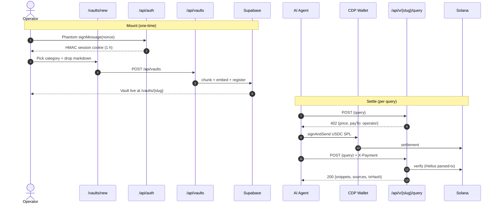

<div align="center">

<picture>
  <source media="(prefers-color-scheme: dark)" srcset="./public/bd-mark-dark.png">
  
</picture>

# Brain Drain

**The protocol AI agents pay vault operators through.**

An `x402` + RAG **multi-vault network** on Solana. Anyone mounts a markdown corpus, AI agents settle USDC per cited snippet, payouts route directly to the operator's Solana address — Brain Drain custodies nothing.

[](./LICENSE)
[](https://solana.com)
[](https://arena.colosseum.org/u/Beks)
[](https://brain-drain-iota.vercel.app)
[](#security-audit)
[](./SECURITY.md)

[Live](https://brain-drain-iota.vercel.app) · [Mount your vault](https://brain-drain-iota.vercel.app/vaults/new) · [Architecture](./docs/architecture.md) · [Frontier submission](https://arena.colosseum.org/u/Beks)

</div>

---

## Problem

Open-web training data is exhausted. Valuable context — researchers' notebooks, engineers' war stories, lawyers' precedent files, traders' edge cases — lives in private vaults. Agents either hallucinate around it or scrape it without consent; the experts who curated it get nothing back.

**There has never been a frictionless rail for an agent to pay the human whose knowledge it just used.**

## Protocol

Brain Drain is **not the marketplace** — it's the **protocol the marketplace runs on**. v0 is a multi-vault network on Solana devnet.

**Operator path.** Connect Phantom, sign a one-shot challenge, drop a markdown bundle at `/vaults/new`. Brain Drain chunks + embeds (Gemini 3072d), persists the index in Supabase Storage, registers the vault with the operator's payout address + category. The vault gets a public x402-gated endpoint at `/api/v/{slug}/query` and a discovery page.

**Buyer path.** An agent (Claude Desktop, Cursor, MCP client, raw HTTP) hits the endpoint. `402 Payment Required` returns USDC price + the operator's payout address. The agent's CDP Embedded Wallet auto-funds, signs an SPL transfer, retries with `X-Payment` proof. Helius RPC verifies the transfer in ~400 ms. Top-k snippets + citations + tx signature return. **USDC lands in the operator's wallet — Brain Drain custodies nothing.**

Devnet by choice for v0; mainnet cutover is one env flip. Protocol logic is identical across networks.

## How it works


```mermaid
sequenceDiagram
    autonumber
    actor Operator
    participant UI as /vaults/new
    participant Auth as /api/auth
    participant Reg as /api/vaults
    participant Store as Supabase
    participant Buyer as AI Agent
    participant CDP as CDP Wallet
    participant Vault as /api/v/{slug}/query
    participant Sol as Solana

    Note over Operator,Store: Mount (one-time)
    Operator->>Auth: Phantom signMessage(nonce)
    Auth-->>Operator: HMAC session cookie (1 h)
    Operator->>UI: Pick category + drop markdown
    UI->>Reg: POST /api/vaults
    Reg->>Store: chunk + embed + register
    Store-->>Operator: Vault live at /vaults/{slug}

    Note over Buyer,Sol: Settle (per query)
    Buyer->>Vault: POST {query}
    Vault-->>Buyer: 402 {price, payTo: operator}
    Buyer->>CDP: signAndSend USDC SPL
    CDP->>Sol: settlement
    Buyer->>Vault: POST {query} + X-Payment
    Vault->>Sol: verify (Helius parsed-tx)
    Vault-->>Buyer: 200 {snippets, sources, txHash}
```

Component-level detail in [`docs/architecture.md`](./docs/architecture.md).

## Catalog

Public catalog at [`/vaults`](https://brain-drain-iota.vercel.app/vaults). Every upload picks one of 8 categories: `engineering`, `trading`, `defi`, `research`, `productivity`, `design`, `legal`, `other`. Free-form tags (max 8, normalized) carry long-tail nuance.

**Vault depth standard:** every chunk should be specific enough that an agent would pay $0.05 to read it. Real dates, real tickers/versions, real error messages, real outcomes.

## Stack

| Layer | Choice |
| :-- | :-- |
| **Frontend** | Next.js 16 App Router · React 19 · Tailwind CSS 4 · Framer Motion 12 · Turbopack |
| **Backend** | Vercel serverless · Supabase Postgres + Storage (eu-central-1) · Postgres-backed token-bucket rate limiter · Zod 4 |
| **Auth** | Sign-in-with-Solana — `tweetnacl` ed25519 + HMAC-SHA256 session cookies (1 h TTL) |
| **Blockchain** | Solana devnet · `@solana/web3.js` · `@solana/spl-token` · `bs58` |
| **RPC** | Helius parsed-tx + signatures-for-address (~400 ms confirmed) |
| **Payment** | `x402-next` v1.2 (Coinbase × Cloudflare) · CDP Embedded Wallets (`@coinbase/cdp-sdk` MPC) · `TransactionModifyingSigner` |
| **Agent** | Anthropic MCP server (`/api/mcp`) — 4 paid tools · raw HTTP · `@modelcontextprotocol/sdk` v1.29 |
| **RAG** | Custom ~200 lines (no LangChain, no vector DB) · Gemini 3.1 Pro + `gemini-embedding-001` 3072d (in-memory cosine) · Vercel AI SDK |
| **Payout** | Operator's Solana address — Brain Drain never holds funds |

**No Anchor / Rust.** All on-chain logic is composed from existing primitives (SPL transfers, CDP MPC, x402, Helius parsed-tx). The novelty is in the wiring.

**No vector DB.** Per-vault index lives in Supabase Storage as JSON; in-process LRU caches 32 vaults for 5 min. Cosine top-k is a literal `for` loop. Submit-grade because it's small enough to read end-to-end in 5 minutes.

## Frontier 2026 — submitted bounties

Submitted via [arena.colosseum.org/u/Beks](https://arena.colosseum.org/u/Beks). Awaiting judging.

| Bounty | How |
| :-- | :-- |
| Best Multi-Protocol Agent Hub | x402 + CDP wallet + MCP server + Solana settlement chained into one route |
| Best x402 Integration | Reference implementation on Solana — full spec compliance, multi-vault per-operator routing, atomic distributed rate limit |
| Best CDP Embedded Wallets | Buyer-side MPC `TransactionModifyingSigner` — auto-fund + auto-sign, no raw-key handling |
| Best AgentPay Demo | 3-minute submission video — agentic settlement end-to-end with on-chain proof |

Also submitted to the **Halborn security track** (CSO audit + OWASP Top 10 mapping) and the **Solana Foundation Turkey $3K builder grant**.

## Quickstart

**Prerequisites:** Bun ≥ 1.3, Helius API key, Coinbase CDP project (Wallet Secret), Google AI key (Gemini 3.1 Pro), Supabase project, 32-byte hex `AUTH_SECRET`.

```bash
git clone https://github.com/Bekirerdem/brain-drain.git
cd brain-drain
bun install
cp .env.example .env.local   # fill keys, see comments

bun -e 'console.log(require("crypto").randomBytes(32).toString("hex"))'   # AUTH_SECRET

# Apply Supabase migrations via dashboard or supabase CLI, then:
bun scripts/seed-vault-supabase.ts          # seed a vault
bun scripts/multi-buyer-traffic.ts          # (optional) organic settlement traffic
bun dev
```

Routes:
- `/vaults` — catalog, category filter
- `/vaults/new` — mount your bundle
- `/vaults/{slug}` — detail + live `VaultProbeWidget`
- `/dashboard` — operator panel
- `POST /api/v/{slug}/query` — paid x402-gated endpoint
- `POST /api/mcp` — Streamable HTTP MCP transport

## Roadmap

11-day solo sprint, public commits from Day 0. Full plan in [`docs/roadmap.md`](./docs/roadmap.md).

- [x] **Day 0–2** — Repo, scaffold, markdown loader + Gemini RAG + x402 middleware
- [x] **Day 3–5** — CDP Embedded Wallet buyer flow, MCP server, end-to-end verified
- [x] **Day 6–7** — Frontend rebuild, multi-vault MVP, CSO audit
- [x] **Day 8–9** — Network seed + MCP v0.3, category taxonomy
- [x] **Day 10** — Frontier submission, OWASP Top 10 mapping
- [x] **Day 11–13** — Demo video, Halborn track submission, Foundation Turkey grant submission, Twitter announce
- [ ] **Post-Frontier** — Mainnet cutover, MCP catalog distribution (Smithery, Cursor, awesome-mcp-servers), operator outreach

## Security audit

Pre-submission CSO-grade audit. **All 10 findings resolved** — eight by patch, two by documented mitigation + scope-limit + post-submit migration plan.

| ID | Finding | Status |
|----|---------|--------|
| BD-01 | `/api/vaults` POST trust-the-body — vault impersonation | ✅ Sign-in-with-Solana (`3c40bd5`) |
| BD-02 | `/api/vaults?owner=` private vault leak | ✅ Session-gated owner branch (`3c40bd5`) |
| BD-03 | Phantom auth no signature verification | ✅ ed25519 nonce flow (`3c40bd5`) |
| BD-04 | Axios prototype pollution (transitive) | ✅ `^1.12.0` override → v1.13.6 |
| BD-05 | bigint-buffer overflow (transitive) | ✅ Scope-limited (read-only ATA derivation, no user bigint input); `@solana/kit` migration post-submit |
| BD-06 | No rate limit on expensive embeds | ✅ Supabase token-bucket (`4d10331`) |
| BD-07 | Waitlist PII in logs | ✅ SHA-256 redaction (`740809f`) |
| BD-08 | Supabase/Zod errors leaked | ✅ `lib/errors.ts` sanitize (`ff5a6cd`) |
| BD-09 | postcss XSS (build-time) | ✅ Override ≥8.5.10 (`0abfbbe`) |
| BD-10 | Missing security headers | ✅ X-Frame-Options DENY, nosniff, Permissions-Policy, Referrer-Policy (`ff5a6cd`) |

Second audit pass after Day 10's layout + ledger + theme changes (`46837f7`) → **no new findings**. New surfaces (`vault_settlements` trigger, `ThemeProvider` localStorage, `GitHubStarButton` fetch, theme CSS vars) — none reached authenticated paths.

### OWASP Top 10 (2021) coverage

| OWASP | Mapped controls |
| :-- | :-- |
| A01 Broken Access Control | BD-01, BD-02 — server-derived `owner_wallet`; `/api/vaults?owner=` session match; Postgres RLS on `vaults` + `vault_settlements` |
| A02 Cryptographic Failures | BD-03 + `lib/auth/session.ts` — `tweetnacl.sign.detached.verify` ed25519, HMAC-SHA256 with `timingSafeEqual` |
| A03 Injection | Zod parse at every API boundary, Supabase parameter-binding queries, no raw SQL concatenation |
| A04 Insecure Design | Ledger PK on `signature` → replay impossible; trigger keeps counters in lock-step; atomic per-key rate-limit buckets |
| A05 Security Misconfiguration | BD-10 — security headers in `next.config.ts`; service-role key server-only |
| A06 Vulnerable Components | BD-04, BD-09 — `axios ^1.12.0`, `postcss ^8.5.10` overrides; `npm ls` clean. BD-05 documented mitigation |
| A07 Authentication Failures | BD-03 + challenge replay protection — 5-min nonce TTL, 1-h HMAC cookie, constant-time comparison |
| A08 Software & Data Integrity | BD-08 — coarse public errors, internal logs in Vercel; PRs require code-owner review (`.github/CODEOWNERS`) |
| A09 Logging & Monitoring | Structured `console.error` JSON in `lib/errors.ts`, `lib/ratelimit.ts`; rate-limit fail-open logs prefix |
| A10 SSRF | No user-controlled URL fetches; legacy RPC indexer reads only known Helius endpoints; `GitHubStarButton` hits literal repo URL |

### Reproducing

- `bun scripts/smoke.ts` — exits non-zero on regression across pages, REST endpoints, MCP `tools/list`, x402 quote, unauth POSTs. 16/16 passing.
- `npm ls axios bigint-buffer postcss ip-address` — confirms override resolutions.
- Disclosure: [`SECURITY.md`](./SECURITY.md) · Repo entry-points: [`docs/agent-onboarding.md`](./docs/agent-onboarding.md).

## Contributing

Hackathon submissions in — judging phase. Project continues post-Frontier. Issues, ideas, friendly heckling welcome — open a GitHub issue or DM [@l3ekirerdem](https://x.com/l3ekirerdem).

## License

[MIT](./LICENSE) © 2026 Bekir Erdem

## Acknowledgments

Built solo for [Colosseum Frontier 2026](https://colosseum.com/frontier), supported by [Superteam Earn's Agentic Engineering Grant](https://superteam.fun/earn/grants/agentic-engineering/). Built on [CDP](https://portal.cdp.coinbase.com), [Phantom](https://phantom.com), [Helius](https://helius.dev), [Supabase](https://supabase.com), [Solana](https://solana.org). [`x402`](https://github.com/coinbase/x402) by Coinbase × Cloudflare · [MCP](https://modelcontextprotocol.io) by Anthropic · [Gemini](https://deepmind.google) by Google DeepMind.

Development cadence shaped by [solana.new](https://solana.new) — SendAI + Superteam's open-source platform. CSO audit ran on its `cso` skill.

Built in Bursa during the Kozalak-hosted DevPack Frontier 2026, alongside [Snowball](https://github.com/Thorigix/Snowball) and [AuraCast](https://github.com/sayweer/AuraCast) — three Solana protocols from one community node.

---

<div align="center">

**Brain Drain** · solo build for Frontier 2026 · by [Bekir Erdem](https://bekirerdem.dev)

[Repo](https://github.com/Bekirerdem/brain-drain) · [Frontier profile](https://arena.colosseum.org/u/Beks) · [X](https://x.com/l3ekirerdem) · [GitHub](https://github.com/Bekirerdem)

</div>
