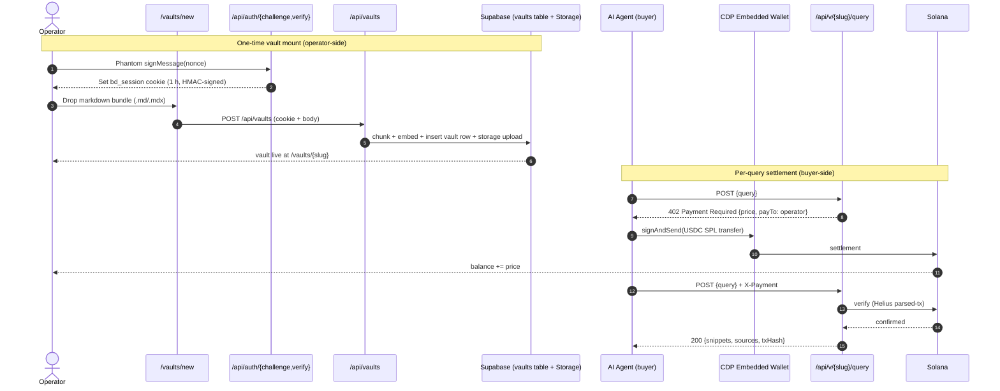

<div align="center">

# Brain Drain

**The protocol AI agents pay vault operators through.**

An `x402` + RAG **multi-vault network** on Solana. Anyone can mount a maintained markdown corpus, AI agents settle **0.25 USDC** (operator-set, 0.05–5.00 range) per cited snippet, payouts route directly to the operator's Solana address — Brain Drain itself never custodies the funds.

[](./LICENSE)
[](https://solana.com)
[](https://colosseum.com/frontier)
[](https://brain-drain-iota.vercel.app)
[](#security-audit)

[Live](https://brain-drain-iota.vercel.app) · [Mount your vault](https://brain-drain-iota.vercel.app/vaults/new) · [Architecture](./docs/architecture.md) · [Frontier submission](https://arena.colosseum.org/u/Beks)

</div>

---

## The problem

Open-web training data is exhausted. The most valuable knowledge — the kind that actually moves a domain forward — lives in private vaults: researchers' notebooks, engineers' war-stories, lawyers' precedent files, traders' edge cases. AI agents either hallucinate around this gap or scrape it without consent. The humans who curated that knowledge get nothing back.

There has never been a frictionless rail for an AI agent to compensate the human whose context it just consumed.

## The protocol, in one shape

Brain Drain is **not the marketplace** — it's the **protocol the marketplace runs on**. v0 ships a working multi-vault network on Solana devnet:

1. An operator connects Phantom, signs a one-shot challenge, and uploads a markdown bundle at `/vaults/new`.
2. Brain Drain chunks + embeds the corpus (Gemini 3072d), persists the index in Supabase Storage, registers the vault in Postgres with the operator's wallet + payout address.
3. The vault gets a public, x402-gated endpoint at `/api/v/{slug}/query` and a discovery page at `/vaults/{slug}`.
4. An external agent (Claude Desktop, Cursor, custom MCP client, raw HTTP) hits the endpoint with a query.
5. The endpoint replies `402 Payment Required` with USDC price + the **operator's** payout address.
6. The agent's wallet — typically a Coinbase CDP Embedded Wallet — auto-funds, auto-signs an SPL transfer, retries with `X-Payment` proof.
7. Helius RPC verifies the on-chain transfer (`confirmed` commitment, ~400 ms). The endpoint returns the top-k snippets with citations and the tx signature.
8. USDC lands in the operator's address. Brain Drain holds nothing.

**Devnet by choice for the v0 demo** — submission budget is solo, mainnet cutover is one env flip (`SOLANA_NETWORK=mainnet-beta` + RPC URL + USDC mint). x402 protocol logic is identical across networks.

## How it works


```mermaid
sequenceDiagram
    autonumber
    actor Operator
    participant UI as /vaults/new
    participant Auth as /api/auth/{challenge,verify}
    participant Reg as /api/vaults
    participant Store as Supabase (vaults table + Storage)
    participant Buyer as AI Agent (buyer)
    participant CDP as CDP Embedded Wallet
    participant Vault as /api/v/{slug}/query
    participant Sol as Solana

    Note over Operator,Store: One-time vault mount (operator-side)
    Operator->>Auth: Phantom signMessage(nonce)
    Auth-->>Operator: Set bd_session cookie (1 h, HMAC-signed)
    Operator->>UI: Drop markdown bundle (.md/.mdx)
    UI->>Reg: POST /api/vaults (cookie + body)
    Reg->>Store: chunk + embed + insert vault row + storage upload
    Store-->>Operator: vault live at /vaults/{slug}

    Note over Buyer,Sol: Per-query settlement (buyer-side)
    Buyer->>Vault: POST {query}
    Vault-->>Buyer: 402 Payment Required {price, payTo: operator}
    Buyer->>CDP: signAndSend(USDC SPL transfer)
    CDP->>Sol: settlement
    Sol-->>Operator: balance += price
    Buyer->>Vault: POST {query} + X-Payment
    Vault->>Sol: verify (Helius parsed-tx)
    Sol-->>Vault: confirmed
    Vault-->>Buyer: 200 {snippets, sources, txHash}
```

See [`docs/architecture.md`](./docs/architecture.md) for component-level detail.

## Tech stack

| Layer | Choice | Why |
| :-- | :-- | :-- |
| Framework | **Next.js 16** (App Router) on Vercel | Fast iteration, edge-compatible, first-class TS |
| Database / Storage | **Supabase** Postgres + Storage (eu-central-1) | Multi-tenant vault registry + per-vault index objects, RLS-bounded |
| Settlement | **Solana** via `@solana/web3.js` + `@solana/spl-token` | Sub-second finality, fees too small to matter |
| Payment standard | **`x402-next` v1.2** (Coinbase / Cloudflare protocol) | Native rail for machine-to-machine commerce, full spec compliance |
| Operator auth | **Sign-in-with-Solana** — `tweetnacl` ed25519 over server nonces, HMAC-signed session cookies | No email, no password — wallet *is* identity |
| Buyer wallet | **Coinbase CDP** Embedded Wallets (`@coinbase/cdp-sdk`) | TS-only MPC, no Anchor program needed |
| Operator payout | **Operator's Solana address** (defaults to owner wallet, override per vault) | Brain Drain never holds funds |
| RPC | **Helius** | ~400 ms `confirmed` commitment, free tier covers the demo |
| Reasoning (downstream agent) | **Gemini 3.1 Pro Preview** with `thinking_level` | Frontier-class extraction; agent-side, not Brain Drain |
| Embeddings | **`gemini-embedding-001`** (3072d) | In-memory cosine across the per-vault index |
| Agent surface | **MCP server** (`/api/mcp`) + raw HTTP `/api/v/{slug}/query` | Drops into Claude Desktop, Cursor, Codex, custom MCP — or any HTTP client |
| Rate limiting | Postgres-backed token bucket (atomic `SELECT FOR UPDATE`) | Distributed across Vercel function instances |

> **No Anchor / Rust required.** All on-chain logic is composed from existing primitives (SPL transfers, CDP MPC, x402). The novelty is in the wiring, not in a custom program.

## Frontier 2026 — sponsor bounties targeted

| Bounty | How Brain Drain hits it |
| :-- | :-- |
| Best Multi-Protocol Agent Hub | x402 + CDP wallet + MCP server + Solana settlement chained into one route |
| Best x402 Integration | Reference implementation of x402 on Solana with full spec compliance, multi-vault per-operator routing, atomic distributed rate limit |
| Best Usage of CDP Embedded Wallets | Buyer-side MPC wallet `TransactionModifyingSigner` pattern, auto-fund + auto-sign without raw-key handling |
| Best AgentPay Demo | The 3-minute submission video shows agentic settlement end-to-end with on-chain proof |

> **Phantom CASH bounty** — devnet-only demo by design (solo budget). Mainnet cutover is one env flip; the Cash payout surface works identically when the network flag flips.

## Quickstart (local development)

> **Prerequisites:** [Bun](https://bun.sh) ≥ 1.3, a Helius API key, a Coinbase CDP project (with Wallet Secret), a Google AI key with access to Gemini 3.1 Pro Preview, a Supabase project (free tier), and a 32-byte hex `AUTH_SECRET`.

```bash
git clone https://github.com/Bekirerdem/brain-drain.git
cd brain-drain
bun install

# Fill in keys — see comments in .env.example
cp .env.example .env.local

# Generate AUTH_SECRET:
bun -e 'console.log(require("crypto").randomBytes(32).toString("hex"))'

# Apply Supabase migrations (vaults, auth_challenges, rate_limit_buckets) —
# either via the dashboard SQL editor or via supabase CLI.

# Seed your own vault into Supabase from a local markdown directory
bun scripts/seed-vault-supabase.ts

# Run the API + dashboard
bun dev
```

Then visit `http://localhost:3000`:
- `/vaults` — public vault directory
- `/vaults/new` — connect Phantom + mount your own bundle
- `/dashboard` — operator panel (your vaults + aggregate stats)
- `POST /api/v/{your-slug}/query` — paid endpoint, x402-gated

## Roadmap

11-day solo sprint, public commits from Day 0. Full plan in [`docs/roadmap.md`](./docs/roadmap.md).

- [x] **Day 0 (1 May)** — Repo, scaffold, accounts, env, grant application
- [x] **Day 1–2 (2–3 May)** — Markdown loader + Gemini RAG index + x402 middleware on devnet
- [x] **Day 3–4 (4–5 May)** — CDP Embedded Wallet buyer flow, auto-fund + auto-sign
- [x] **Day 5 (6 May)** — MCP server, end-to-end production verified
- [x] **Day 6 (7 May)** — Frontend rebuild (motion, sections, /dashboard, /vaults)
- [x] **Day 7 (8 May)** — Multi-vault MVP (Supabase registry, sign-in-with-Solana, per-vault routing, /vaults/new), CSO security audit, P0+P1+P2 patches
- [ ] **Day 8 (9 May)** — Demo video, README polish, sample vault seeding for the directory
- [ ] **Day 9 (10 May)** — Submit to Colosseum Frontier 2026
- [ ] **Day 10 (11 May)** — Buffer + post-submission outreach

## Security audit

A self-administered Chief Security Officer-grade audit (`cso` skill, daily 8/10 confidence gate) was run pre-submission. **8 of 10 findings fully resolved** with patch commits; 2 partial/accepted with documented mitigations. Highlights:

| ID | Finding | Status |
|----|---------|--------|
| BD-01 | `/api/vaults` POST trust-the-body — vault impersonation | ✅ Sign-in-with-Solana (`3c40bd5`) |
| BD-02 | `/api/vaults?owner=` private vault leak | ✅ Session-gated owner branch (`3c40bd5`) |
| BD-03 | Phantom auth no signature verification | ✅ ed25519 nonce flow (`3c40bd5`) |
| BD-04 | Axios prototype pollution (transitive) | ⚠️ Partial (postcss + ip-address fixed; axios + bigint-buffer upstream-blocked) |
| BD-05 | bigint-buffer overflow | ⚠️ Accepted — kit migration scope |
| BD-06 | No rate limit on expensive embeds | ✅ Supabase-backed distributed counters (`4d10331`) |
| BD-07 | Waitlist PII in logs | ✅ SHA-256 redaction (`740809f`) |
| BD-08 | Supabase/Zod errors leaked | ✅ `lib/errors.ts` sanitize (`ff5a6cd`) |
| BD-09 | postcss XSS (build-time) | ✅ Override ≥8.5.10 (`0abfbbe`) |
| BD-10 | Missing security headers | ✅ X-Frame-Options DENY, nosniff, Permissions-Policy, Referrer-Policy (`ff5a6cd`) |

Full report at `~/.superstack/security-reports/brain-drain-2026-05-06.md`.

## Contributing

Active hackathon build, but issues, ideas, and friendly heckling are welcome. Open a GitHub issue or DM [@l3ekirerdem](https://x.com/l3ekirerdem).

## License

[MIT](./LICENSE) © 2026 Bekir Erdem

## Acknowledgments

Built solo for [Colosseum Frontier 2026](https://colosseum.com/frontier), powered by [Superteam Earn's Agentic Engineering Grant](https://superteam.fun/earn/grants/agentic-engineering/) and the open ecosystems of [Coinbase Developer Platform](https://portal.cdp.coinbase.com), [Phantom](https://phantom.com), [Helius](https://helius.dev), [Supabase](https://supabase.com), and [Solana Foundation](https://solana.org).

The `x402` standard is the work of the [x402 Foundation](https://x402.tech) (Coinbase × Cloudflare). MCP comes from [Anthropic](https://modelcontextprotocol.io). Gemini comes from [Google DeepMind](https://deepmind.google).

The development cadence (skills, journey templates, hackathon discipline) is shaped by [solana.new](https://solana.new) — SendAI + Superteam's open-source platform — and our `cso` security audit ran on its CSO skill.

Inspired in spirit by Yash Agarwal's call for a *composable personal context layer* in the Solana ecosystem.

---

<div align="center">

**Brain Drain** · solo build for Frontier 2026 · by [Bekir Erdem](https://bekirerdem.dev)

[Repo](https://github.com/Bekirerdem/brain-drain) · [Frontier profile](https://arena.colosseum.org/u/Beks) · [X](https://x.com/l3ekirerdem) · [GitHub](https://github.com/Bekirerdem)

</div>
