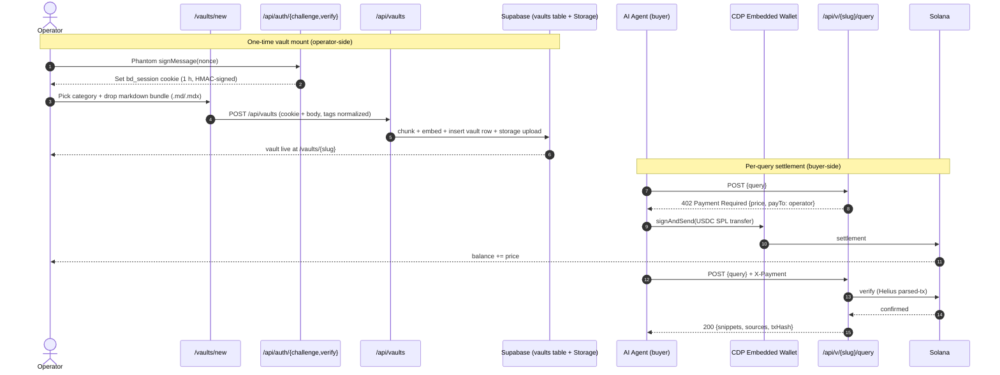

<div align="center">

# Brain Drain

**The protocol AI agents pay vault operators through.**

An `x402` + RAG **multi-vault network** on Solana. Anyone can mount a maintained markdown corpus, AI agents settle USDC per cited snippet, payouts route directly to the operator's Solana address — Brain Drain itself never custodies the funds.

[](./LICENSE)
[](https://solana.com)
[](https://colosseum.com/frontier)
[](https://brain-drain-iota.vercel.app)
[](#security-audit)
[](./SECURITY.md)

[Live](https://brain-drain-iota.vercel.app) · [Mount your vault](https://brain-drain-iota.vercel.app/vaults/new) · [Architecture](./docs/architecture.md) · [Frontier submission](https://arena.colosseum.org/u/Beks)

</div>

---

## The problem

Open-web training data is exhausted. The valuable context — researchers' notebooks, engineers' war stories, lawyers' precedent files, traders' edge cases — lives in private vaults. Agents either hallucinate around it or scrape it without consent; the experts who curated it get nothing back.

**There has never been a frictionless rail for an agent to pay the human whose knowledge it just used.**

## The protocol, in one shape

Brain Drain is **not the marketplace** — it's the **protocol the marketplace runs on**. v0 is a multi-vault network on Solana devnet:

1. Operator connects Phantom, signs a one-shot challenge, drops a markdown bundle at `/vaults/new`.
2. Brain Drain chunks + embeds (Gemini 3072d), persists the index in Supabase Storage, registers the vault with the operator's payout address + category.
3. The vault gets a public x402-gated endpoint at `/api/v/{slug}/query` and a discovery page.
4. An agent (Claude Desktop, Cursor, MCP client, raw HTTP) hits the endpoint with a query.
5. `402 Payment Required` returns USDC price + the **operator's** payout address.
6. The agent's CDP Embedded Wallet auto-funds, signs an SPL transfer, retries with `X-Payment` proof.
7. Helius RPC verifies the transfer (`confirmed`, ~400 ms). Top-k snippets + citations + tx signature returned.
8. USDC lands in the operator's wallet. **Brain Drain custodies nothing.**

Devnet by choice for v0; mainnet cutover is one env flip (`SOLANA_NETWORK=mainnet-beta` + RPC URL + USDC mint). Protocol logic is identical across networks.

## How it works


```mermaid
sequenceDiagram
    autonumber
    actor Operator
    participant UI as /vaults/new
    participant Auth as /api/auth/{challenge,verify}
    participant Reg as /api/vaults
    participant Store as Supabase (vaults table + Storage)
    participant Buyer as AI Agent (buyer)
    participant CDP as CDP Embedded Wallet
    participant Vault as /api/v/{slug}/query
    participant Sol as Solana

    Note over Operator,Store: One-time vault mount (operator-side)
    Operator->>Auth: Phantom signMessage(nonce)
    Auth-->>Operator: Set bd_session cookie (1 h, HMAC-signed)
    Operator->>UI: Pick category + drop markdown bundle (.md/.mdx)
    UI->>Reg: POST /api/vaults (cookie + body, tags normalized)
    Reg->>Store: chunk + embed + insert vault row + storage upload
    Store-->>Operator: vault live at /vaults/{slug}

    Note over Buyer,Sol: Per-query settlement (buyer-side)
    Buyer->>Vault: POST {query}
    Vault-->>Buyer: 402 Payment Required {price, payTo: operator}
    Buyer->>CDP: signAndSend(USDC SPL transfer)
    CDP->>Sol: settlement
    Sol-->>Operator: balance += price
    Buyer->>Vault: POST {query} + X-Payment
    Vault->>Sol: verify (Helius parsed-tx)
    Sol-->>Vault: confirmed
    Vault-->>Buyer: 200 {snippets, sources, txHash}
```

See [`docs/architecture.md`](./docs/architecture.md) for component-level detail.

## Vault catalog & taxonomy

Brain Drain v0 ships with a public catalog at [`/vaults`](https://brain-drain-iota.vercel.app/vaults). Every upload picks **one of 8 predefined categories** — the top-level discovery axis used by the catalog filter and the MCP `brain_drain_list_vaults` tool. Free-form `tags` (max 8, lowercase + hyphen-separated, server-normalized) carry the long-tail nuance.

| Category | Fits | Example seed vault |
| :-- | :-- | :-- |
| `engineering` | Debugging war stories, named library versions, working code with the actual error you hit | `x402-solana-build-log`, `koza-l1-playbook`, `devops-gotchas` |
| `trading` | Real PnL, specific tickers + timing, anti-patterns with bifurcation data | (operator-uploaded) |
| `defi` | Protocol mechanics with math, governance rationale, liquidity outcomes | (open) |
| `research` | Long-form synthesis with citations, original framing on top of others' work | (open) |
| `productivity` | Reproducible setups, command sequences, decision rules you actually follow | (open) |
| `design` | Reference shots, anti-slop checks, component variants with the trade-off you picked | (open) |
| `legal` | Citation-grade case law, redacted real precedent, jurisdiction-specific decision trees | (open) |
| `other` | Catch-all (lowest discovery — prefer a closer match) | `bekir-erdem` |

**Vault depth standard:** every chunk should be specific enough that an agent would pay $0.05 to read it. Real dates, real tickers/versions, real error messages, real outcomes. Generic explainers don't belong in a paid vault.

## Tech stack

Grouped so judges (and Wappalyzer) can read the protocol stack at a glance — the public-web crawl only sees the frontend layer.

| Layer | Choice | Why |
| :-- | :-- | :-- |
| **Frontend** | **Next.js 16** App Router · React 19 · Tailwind CSS 4 · Turbopack · Framer Motion 12 | Fast iteration, edge-compatible, first-class TS, Turbopack dev/build |
| **Backend** | **Vercel** serverless · **Supabase** Postgres + Storage (eu-central-1) · Postgres-backed token-bucket rate limiter (`SELECT FOR UPDATE`) · **Zod 4** at every boundary | Multi-instance-safe rate limit + RLS-bound vault registry + per-vault index objects |
| **Auth** | **Sign-in-with-Solana** — `tweetnacl` ed25519 over server-issued nonces · HMAC-SHA256-signed session cookies (1 h TTL) · Supabase-backed challenge replay-protection | No email, no password — wallet *is* identity. Stateless cookie, no per-request DB lookup |
| **Blockchain** | **Solana** (devnet) · `@solana/web3.js` + `@solana/spl-token` · `bs58` | Sub-second finality, fees too small to matter, USDC SPL transfer pattern |
| **RPC** | **Helius** parsed-tx + signatures-for-address | ~400 ms `confirmed` commitment, free tier covers the demo |
| **Payment** | **`x402-next` v1.2** (Coinbase × Cloudflare protocol) · **Coinbase CDP** Embedded Wallets (`@coinbase/cdp-sdk` MPC) · `TransactionModifyingSigner` pattern | Native rail for machine-to-machine commerce, full spec compliance, MPC without raw-key handling |
| **Agent surface** | **Anthropic MCP** server (`/api/mcp`) — 4 paid tools · raw HTTP `/api/v/{slug}/query` · `@modelcontextprotocol/sdk` v1.29 | Drops into Claude Desktop, Cursor, Codex, custom MCP, or any HTTP client |
| **AI / RAG** | **Custom RAG**, no LangChain, no LlamaIndex, no pgvector, no Pinecone — ~200 lines · **Gemini 3.1 Pro Preview** (downstream agent reasoning) · `gemini-embedding-001` 3072d (in-memory cosine) · **Vercel AI SDK** (`embedMany` batch 50) | Tight control, audit-friendly, ~100-300 ms per-query latency, Gemini cost per chunk ≈ \$0.000013 |
| **Operator payout** | Operator's Solana address (defaults to owner wallet, override per vault) | Brain Drain never holds funds — `payTo` in the 402 quote is the operator's address |

> **No Anchor / Rust required.** All on-chain logic is composed from existing primitives (SPL transfers, CDP MPC, x402, Helius parsed-tx). The novelty is in the wiring, not in a custom program.

> **No vector DB.** Per-vault index files live in Supabase Storage as JSON; an in-process LRU (5-min TTL, max 32 vaults) caches them across requests. Cosine top-k is a literal `for` loop. Submit-grade because it's small enough to read end-to-end in 5 minutes.

## Frontier 2026 — sponsor bounties targeted

| Bounty | How Brain Drain hits it |
| :-- | :-- |
| Best Multi-Protocol Agent Hub | x402 + CDP wallet + MCP server + Solana settlement chained into one route |
| Best x402 Integration | Reference implementation of x402 on Solana with full spec compliance, multi-vault per-operator routing, atomic distributed rate limit |
| Best Usage of CDP Embedded Wallets | Buyer-side MPC wallet `TransactionModifyingSigner` pattern, auto-fund + auto-sign without raw-key handling |
| Best AgentPay Demo | The 3-minute submission video shows agentic settlement end-to-end with on-chain proof |

> **Phantom CASH bounty** — devnet-only demo by design (solo budget). Mainnet cutover is one env flip; the Cash payout surface works identically when the network flag flips.

## Quickstart (local development)

> **Prerequisites:** [Bun](https://bun.sh) ≥ 1.3, a Helius API key, a Coinbase CDP project (with Wallet Secret), a Google AI key with access to Gemini 3.1 Pro Preview, a Supabase project (free tier), and a 32-byte hex `AUTH_SECRET`.

```bash
git clone https://github.com/Bekirerdem/brain-drain.git
cd brain-drain
bun install

# Fill in keys — see comments in .env.example
cp .env.example .env.local

# Generate AUTH_SECRET:
bun -e 'console.log(require("crypto").randomBytes(32).toString("hex"))'

# Apply Supabase migrations (vaults, auth_challenges, rate_limit_buckets,
# vault_feedback, vault_category enum) — either via the dashboard SQL
# editor or via supabase CLI.

# Seed your own vault into Supabase from a local markdown directory
bun scripts/seed-vault-supabase.ts

# Generate organic settlement traffic (multi-buyer, multi-vault) for the
# live activity feed:
bun scripts/multi-buyer-traffic.ts

# Run the API + dashboard
bun dev
```

Then visit `http://localhost:3000`:
- `/vaults` — public catalog, filterable by category
- `/vaults/new` — connect Phantom + pick category + mount your bundle
- `/vaults/{slug}` — per-vault detail with live `VaultProbeWidget` (real 402 quote, no settlement)
- `/dashboard` — operator panel (your vaults + aggregate stats)
- `POST /api/v/{your-slug}/query` — paid endpoint, x402-gated
- `POST /api/mcp` — Streamable HTTP MCP transport (drop into Claude Desktop)

## Roadmap

11-day solo sprint, public commits from Day 0. Full plan in [`docs/roadmap.md`](./docs/roadmap.md).

- [x] **Day 0 (1 May)** — Repo, scaffold, accounts, env, grant application
- [x] **Day 1–2 (2–3 May)** — Markdown loader + Gemini RAG index + x402 middleware on devnet
- [x] **Day 3–4 (4–5 May)** — CDP Embedded Wallet buyer flow, auto-fund + auto-sign
- [x] **Day 5 (6 May)** — MCP server, end-to-end production verified
- [x] **Day 6 (7 May)** — Frontend rebuild (motion, sections, /dashboard, /vaults)
- [x] **Day 7 (8 May)** — Multi-vault MVP (Supabase registry, sign-in-with-Solana, per-vault routing, /vaults/new), CSO security audit, P0+P1+P2 patches
- [x] **Day 8 (9 May)** — Multi-vault network seed, satisfaction signal, MCP v0.3 with 4 tools
- [x] **Day 9 (10 May)** — Category taxonomy, tag normalization, README polish, Frontier submission
- [ ] **Day 10 (11 May)** — Buffer + post-submission outreach

## Security audit

Pre-submission CSO-grade audit (`cso` skill, 8/10 confidence gate). **All 10 findings resolved** — eight by patch, two by documented mitigation + scope-limit + post-submit migration plan.

| ID | Finding | Status |
|----|---------|--------|
| BD-01 | `/api/vaults` POST trust-the-body — vault impersonation | ✅ Sign-in-with-Solana (`3c40bd5`) |
| BD-02 | `/api/vaults?owner=` private vault leak | ✅ Session-gated owner branch (`3c40bd5`) |
| BD-03 | Phantom auth no signature verification | ✅ ed25519 nonce flow (`3c40bd5`) |
| BD-04 | Axios prototype pollution (transitive) | ✅ `^1.12.0` override resolves to v1.13.6 — CVE-2024-39338 + later advisories all patched. Verified via `npm ls axios` |
| BD-05 | bigint-buffer overflow (transitive) | ✅ Mitigated by usage scope — only reached via `getAssociatedTokenAddressSync` for read-only ATA derivation; no user-controlled bigint inputs flow into it. Post-submit `@solana/kit` migration removes the dependency entirely |
| BD-06 | No rate limit on expensive embeds | ✅ Supabase-backed distributed counters (`4d10331`) |
| BD-07 | Waitlist PII in logs | ✅ SHA-256 redaction (`740809f`) |
| BD-08 | Supabase/Zod errors leaked | ✅ `lib/errors.ts` sanitize (`ff5a6cd`) |
| BD-09 | postcss XSS (build-time) | ✅ Override ≥8.5.10 (`0abfbbe`) |
| BD-10 | Missing security headers | ✅ X-Frame-Options DENY, nosniff, Permissions-Policy, Referrer-Policy (`ff5a6cd`) |

Full report: `~/.superstack/security-reports/brain-drain-2026-05-06.md`.

A second pass after Day 10's layout + ledger + theme changes (`46837f7`) produced **no new findings**. New surfaces — `vault_settlements` trigger (`SECURITY DEFINER`), `ThemeProvider` localStorage, `GitHubStarButton` public fetch, `--color-chrome*` CSS vars — none reached authenticated paths or escaped existing RLS + rate-limit coverage.

### OWASP Top 10 (2021) coverage

| OWASP category | Mapped controls |
| :-- | :-- |
| **A01 Broken Access Control** | BD-01 + BD-02 — server-derived `owner_wallet` on every vault mutation; `/api/vaults?owner=` requires session match; Postgres RLS on `vaults` (public + owner-private split) and `vault_settlements` (read-only public, service-role writes) |
| **A02 Cryptographic Failures** | BD-03 + `lib/auth/session.ts` — `tweetnacl.sign.detached.verify` for ed25519, `node:crypto.createHmac("sha256", AUTH_SECRET)` with `timingSafeEqual` on every cookie verification; no bespoke crypto |
| **A03 Injection** | Zod parse at every API boundary (`lib/errors.ts:zodFieldError`); Postgres queries go through Supabase's parameter-binding client; no raw SQL string concatenation |
| **A04 Insecure Design** | Ledger PK on `signature` makes settlement replay impossible by-construction; trigger keeps counters in lock-step with the ledger; rate-limit buckets are per-key + atomic |
| **A05 Security Misconfiguration** | BD-10 — `X-Frame-Options: DENY`, `X-Content-Type-Options: nosniff`, `Referrer-Policy`, `Permissions-Policy` shipped in `next.config.ts`; service-role key never reaches the client bundle (`lib/env.ts` is server-only and verified post-3d7ba1a regression) |
| **A06 Vulnerable Components** | BD-04 + BD-09 — `axios ^1.12.0` and `postcss ^8.5.10` in `package.json` overrides; `npm ls` clean. BD-05 documented mitigation (read-only ATA derivation, no user bigint input) |
| **A07 Authentication Failures** | BD-03 + replay protection — challenges deleted on consume in `lib/auth/challenge.ts`; nonces 5-minute TTL; HMAC cookie 1-hour TTL with constant-time comparison |
| **A08 Software & Data Integrity** | BD-08 — public errors are coarse, internal errors stay in Vercel logs; PRs require code-owner review (`.github/CODEOWNERS`) |
| **A09 Logging & Monitoring** | Structured `console.error` JSON in `lib/errors.ts:logAndSanitize` and `lib/ratelimit.ts`; rate-limit fail-open events log a key prefix so the operator can grep Vercel logs |
| **A10 Server-Side Request Forgery** | No user-controlled URL fetches in any route; `getNetworkPayouts` (RPC indexer, legacy) reads only known Helius endpoints; `GitHubStarButton` only hits the literal `api.github.com/repos/Bekirerdem/brain-drain` URL |

### Reproducing the audit

- `bun scripts/smoke.ts` — exits non-zero on any regression across pages, REST endpoints, MCP `tools/list`, x402 quote, and unauthenticated POSTs.
- `npm ls axios bigint-buffer postcss ip-address` — confirms override resolutions.
- Disclosure policy: [`SECURITY.md`](./SECURITY.md). Repo entry-point map: [`docs/agent-onboarding.md`](./docs/agent-onboarding.md).

## Contributing

Active hackathon build, but issues, ideas, and friendly heckling are welcome. Open a GitHub issue or DM [@l3ekirerdem](https://x.com/l3ekirerdem).

## License

[MIT](./LICENSE) © 2026 Bekir Erdem

## Acknowledgments

Built solo for [Colosseum Frontier 2026](https://colosseum.com/frontier), supported by [Superteam Earn's Agentic Engineering Grant](https://superteam.fun/earn/grants/agentic-engineering/). Built on [CDP](https://portal.cdp.coinbase.com), [Phantom](https://phantom.com), [Helius](https://helius.dev), [Supabase](https://supabase.com), [Solana](https://solana.org). [`x402`](https://github.com/coinbase/x402) by Coinbase × Cloudflare; [MCP](https://modelcontextprotocol.io) by Anthropic; [Gemini](https://deepmind.google) by Google DeepMind.

The development cadence (skills, journey templates, hackathon discipline) is shaped by [solana.new](https://solana.new) — SendAI + Superteam's open-source platform — and our `cso` security audit ran on its CSO skill.

Inspired in spirit by Yash Agarwal's call for a *composable personal context layer* in the Solana ecosystem.

---

<div align="center">

**Brain Drain** · solo build for Frontier 2026 · by [Bekir Erdem](https://bekirerdem.dev)

[Repo](https://github.com/Bekirerdem/brain-drain) · [Frontier profile](https://arena.colosseum.org/u/Beks) · [X](https://x.com/l3ekirerdem) · [GitHub](https://github.com/Bekirerdem)

</div>
