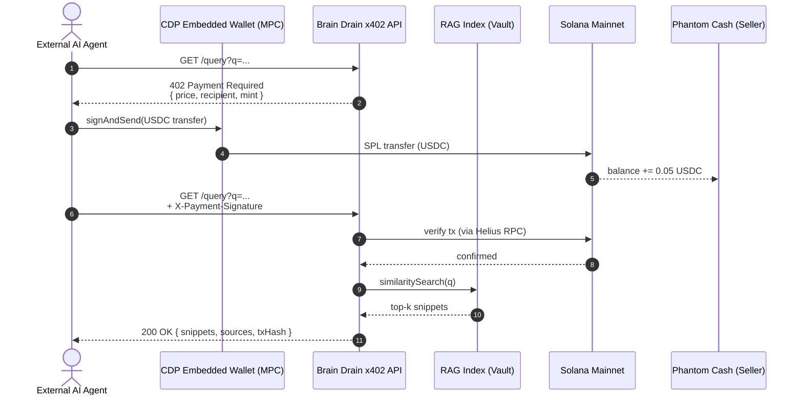

# Brain Drain — Architecture

## High-level flow

## Components

### 1. Vault loader (`scripts/seed-vault.ts`)
Reads a directory of `.md` files (Obsidian vault), extracts frontmatter via `gray-matter`, chunks the body, and stores in a local index. v0 uses a flat JSON index; v1 may move to a vector DB.

### 2. RAG index (`src/lib/rag.ts`)
- **Embeddings:** Google `gemini-embedding-001` via `@ai-sdk/google`
- **Storage:** in-memory + on-disk JSON for the MVP (fast enough for ~5k chunks)
- **Retrieval:** cosine similarity, top-k = 3, with snippet truncation to ~400 tokens
- **Reasoning over snippets:** `gemini-3.1-pro-preview` (default — frontier-class with `thinking_level` control), `gemini-2.5-flash` fallback for trivial queries to keep cost down; Claude Haiku 4.5 optional for multi-model demo

### 3. x402 middleware (`src/lib/x402.ts`)
A Next.js route handler that:
1. Returns `HTTP 402` with `WWW-Authenticate: x402` headers when no payment proof is present
2. Verifies the `X-Payment-Signature` (Solana tx signature) by calling Helius RPC
3. On confirmation, releases the snippet payload

### 4. Coinbase CDP client (`src/lib/cdp.ts`)
Buyer-side: creates an MPC wallet for a calling agent, funds it from a treasury (devnet faucet for testing, real USDC on mainnet), signs the SPL transfer, returns the signature for the agent to attach to its retry.

### 5. Solana settlement (`src/lib/solana.ts`)
- USDC SPL transfer via `@solana/spl-token`
- Tx verification: confirm > 1 finality
- Helius RPC over WebSocket for instant subscription on the seller's address

### 6. MCP server (`src/mcp/server.ts`)
Exposes a single tool `brain_drain.query` to Claude Desktop / Cursor. Tool spec includes price metadata so the agent UI can confirm cost before calling.

### 7. Dashboard (`src/app/dashboard/page.tsx`)
Seller-facing: incoming queries, USDC earned, top-paying agents, snippet hit rate.

## Trust assumptions

- The buyer trusts that the seller's RAG returns relevant snippets. Mitigation in v2: optional LLM-judge layer that scores snippet relevance and refunds bad responses.
- The seller trusts their CDP key custody for the demo treasury. In production, the seller never holds buyer funds — buyers self-custody via their own CDP wallets.

## Out of scope for v0

- Privacy compute (Arcium): planned as a stretch goal, queries today are over plaintext snippets.
- Multi-vault federation: a single seller (Bekir) for the hackathon demo.
- Streaming subscriptions: each query is a one-shot 402.
- Reputation system: deferred to post-hackathon.
